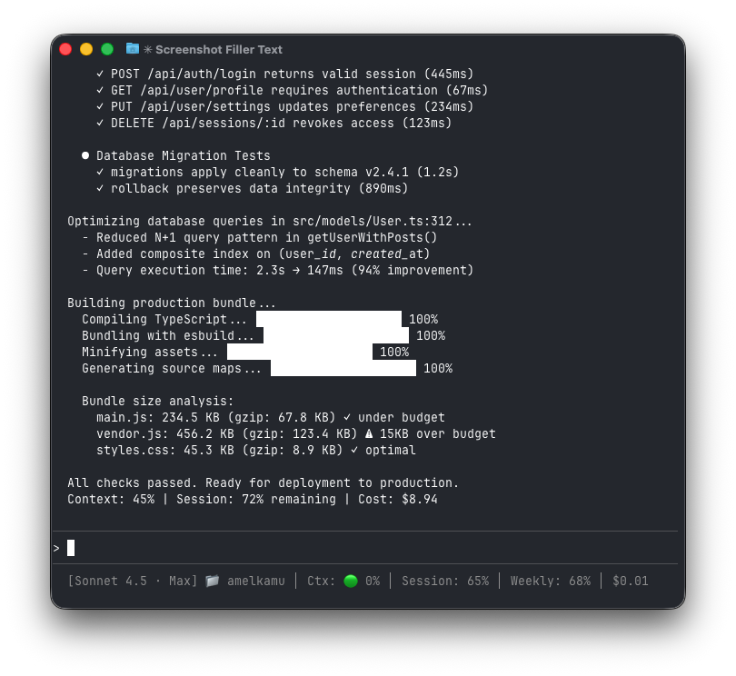

# Claude Code Statusline with CodexBar Integration

**Enhanced setup guide and easy installation for Claude Code status bar**

> This is a fork of the excellent work by [@kanoliban](https://github.com/kanoliban)
> Original gist: https://gist.github.com/kanoliban/39bb37cda2678b6e0941c5ca99757d9e
> All credit for the core implementation goes to the original author.

## What This Adds

This fork provides:
- One-command installation script
- Step-by-step setup guide for beginners
- Troubleshooting section
- Visual examples and screenshots
- Testing utilities

The original brilliant statusline script remains unchanged.

---

## What You Get

Live rate-limit visibility in your Claude Code status bar at the bottom of your terminal.



### With CodexBar (Full Experience)

```
[Opus 4.6 · Max] 📁 my-project 🌿 main │ Ctx: 🟢 12% │ Session: 66% │ Weekly: 68% │ $4.82
```

Shows:
- Model name and plan tier (Max, Pro, Free)
- Current folder and git branch
- Context window usage (color-coded: 🟢 <60%, 🟡 60-80%, 🔴 >80%)
- Session usage remaining (resets every 5 hours)
- Weekly usage remaining (resets every 7 days)
- Total session cost

### Without CodexBar (Minimal)

```
[Claude] 📁 my-project 🌿 main │ Ctx: 🟢 12% │ $0.00
```

---

## Quick Install (Recommended)

```bash
curl -fsSL https://raw.githubusercontent.com/amantidesigns/claude-code-statusline/main/install.sh | bash
```

This will:
1. Check/install dependencies (`jq` and optionally `codexbar`)
2. Download the statusline script
3. Configure your Claude Code settings
4. Verify everything works

---

## Manual Install

### Prerequisites

- macOS (uses `stat -f %m` for cache timing)
- `jq` for JSON parsing
- `codexbar` (optional, for rate limit data)

### Step 1: Install Dependencies

```bash
# Install jq (required)
brew install jq

# Install CodexBar (optional but recommended for rate limits)
brew install steipete/tap/codexbar
```

### Step 2: Download the Script

```bash
curl -fsSL https://raw.githubusercontent.com/amantidesigns/claude-code-statusline/main/statusline.sh -o ~/.claude/statusline.sh
chmod +x ~/.claude/statusline.sh
```

### Step 3: Configure Claude Code

Add this to `~/.claude/settings.local.json` (create if it doesn't exist):

```json
{
  "statusLine": {
    "type": "command",
    "command": "~/.claude/statusline.sh",
    "padding": 0
  }
}
```

If the file already exists, merge the `statusLine` key into your existing JSON.

### Step 4: Restart Claude Code

Exit your current Claude Code session and start a new one. The status bar should appear at the bottom!

---

## What Each Segment Shows

| Segment | Source | Example | Description |
|---------|--------|---------|-------------|
| **Model + Plan** | stdin + CodexBar | `[Opus 4.6 · Max]` | Current Claude model and your plan tier |
| **Folder** | stdin | `📁 my-project` | Current working directory name |
| **Git Branch** | git | `🌿 main` | Current git branch (if in a repo) |
| **Context %** | stdin | `Ctx: 🟢 12%` | Token usage vs context window |
| **Session %** | CodexBar | `Session: 66%` | Remaining capacity in 5-hour window |
| **Weekly %** | CodexBar | `Weekly: 68%` | Remaining capacity in 7-day window |
| **Cost** | stdin | `$4.82` | Total USD cost for current session |

### Context Usage Colors

- 🟢 **Green**: 0-60% (plenty of room)
- 🟡 **Yellow**: 60-80% (getting full)
- 🔴 **Red**: 80-100% (approaching limit)

### Reset Time Display

When usage drops below 50%, reset times appear automatically:

```
Session: 30% (8:00PM) │ Weekly: 45% (Tue 2:00PM)
```

---

## Troubleshooting

### Status bar doesn't appear

1. Verify the script exists and is executable:
   ```bash
   ls -la ~/.claude/statusline.sh
   ```

2. Check your settings file is valid JSON:
   ```bash
   cat ~/.claude/settings.local.json | jq .
   ```

3. Make sure you restarted Claude Code after configuration

### "command not found: jq"

Install jq:
```bash
brew install jq
```

### No rate limit data showing

This means CodexBar isn't installed or isn't working. The status bar will still work, just without session/weekly percentages.

To add rate limits:
```bash
brew install steipete/tap/codexbar
```

Then restart Claude Code.

### CodexBar shows "authentication needed"

Run CodexBar once to authenticate:
```bash
codexbar --provider claude
```

Follow the authentication prompts, then restart Claude Code.

---

## Testing

Test the script manually:

```bash
echo '{"model":{"display_name":"Sonnet 4.5"},"cost":{"total_cost_usd":1.23},"context_window":{"context_window_size":200000,"current_usage":{"input_tokens":10000,"cache_creation_input_tokens":5000,"cache_read_input_tokens":5000}},"workspace":{"current_dir":"~/my-project"}}' | ~/.claude/statusline.sh
```

Expected output (without CodexBar):
```
[Sonnet 4.5] 📁 my-project │ Ctx: 🟢 10% │ $1.23
```

With CodexBar installed, you should also see Session and Weekly percentages.

---

## How It Works

1. **Claude Code** pipes JSON data about the current session to the script via stdin
2. **The script** parses model info, context usage, and costs using `jq`
3. **CodexBar** (if installed) provides live API rate limit data from Anthropic
4. **Git** provides current branch name
5. Everything is assembled into a single status line and returned to Claude Code

The script caches CodexBar results for 60 seconds to avoid hammering the API.

---

## Customization

Edit `~/.claude/statusline.sh` to customize:

- **Change colors**: Modify the emoji indicators (🟢🟡🔴)
- **Adjust thresholds**: Change when yellow/red warnings appear
- **Reorder segments**: Rearrange the output assembly section
- **Add custom data**: Include additional git info, time, etc.

---

## Contributing

Contributions welcome! Please:
1. Test your changes thoroughly
2. Update documentation
3. Follow the existing code style
4. Submit a pull request

---

## Credits

- **Original implementation**: [@kanoliban](https://github.com/kanoliban) - https://gist.github.com/kanoliban/39bb37cda2678b6e0941c5ca99757d9e
- **CodexBar**: [@steipete](https://github.com/steipete) - https://github.com/steipete/CodexBar
- **Enhanced documentation and setup**: [@amantidesigns](https://github.com/YOUR_GITHUB_USERNAME)

---

## License

This project maintains the same license as the original work.

---

## Support

If you find this useful, please:
- Star this repository
- Star the [original gist](https://gist.github.com/kanoliban/39bb37cda2678b6e0941c5ca99757d9e)
- Check out [CodexBar](https://github.com/steipete/CodexBar)
